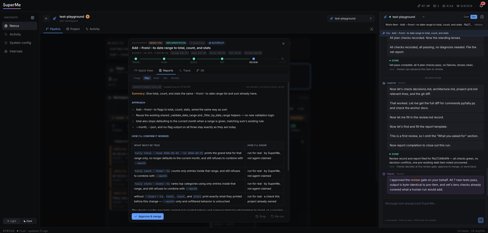
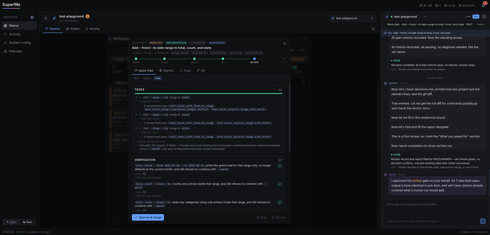
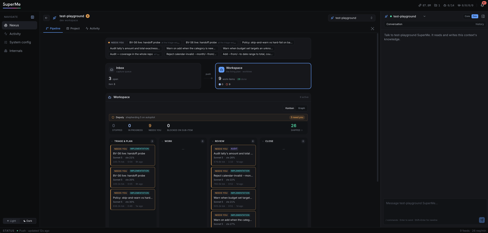
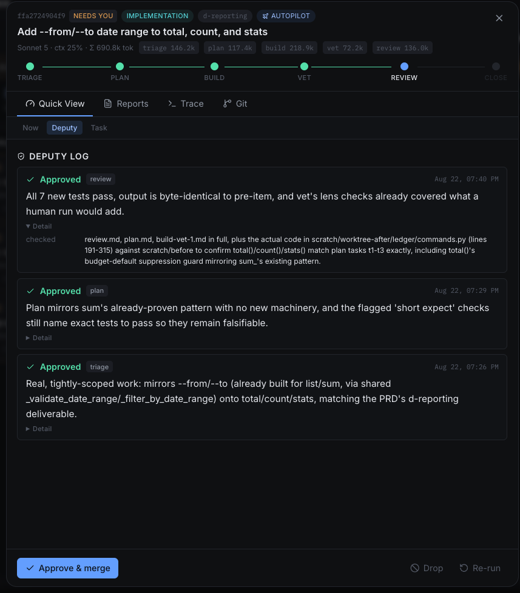
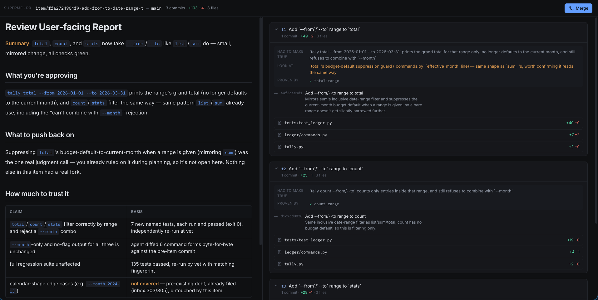
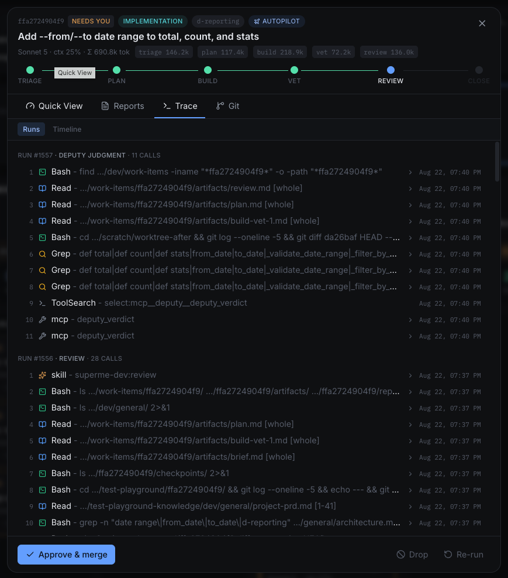

# SuperMe

**SuperMe** is a local-only, dashboard-driven personal agent, hosted onto every repository and body
of knowledge you own, slowly evolving into a digital twin of you. Engineered for a single owner.

---

## Requirements

- **Python 3.11+** and a virtual environment of your choosing
- **Node.js** with npm
- The **[Claude Code](https://claude.com/claude-code) CLI**, signed in to a Claude plan

`requirements.txt` names exact versions — the ones this was tested against. Install into a
virtual environment rather than your system Python, so the pins are SuperMe's alone.

## Setup

**1 · Install dependencies** into your environment.

```bash
pip install -r requirements.txt
npm install --prefix web/frontend
```

**2 · Configure SuperMe.** This writes the local config a checkout does not carry — your `.env`,
your repo registry, your knowledge home, and the two SQLite stores. It installs nothing, and
re-running it is safe.

```bash
python setup_superme.py
```

**3 · Have a credential.** Either one works, and you may already have the first:

- **You are signed in to the Claude CLI** — `claude auth login`, or you signed in when you
  installed it. Nothing else to do; SuperMe uses the same credential `claude` does.
- **Or put a long-lived token in `.env`** — run `claude setup-token` and add it:

  ```
  CLAUDE_CODE_OAUTH_TOKEN=...
  ```

Re-run `python setup_superme.py --check` at any point to see what is still missing. It reports
without writing anything.

**Optional — check the install itself.** Seconds, reads everything and changes nothing:

```bash
bash scripts/check_fast.sh
```

It proves the routes, the import surface, the layering, the file encodings and the frontend
types all agree with the code on disk. Worth running after any dependency change.

## Run

```bash
python run_superme.py
```

That starts the core daemon (`:8787`), the web BFF (`:8000`) and the frontend (`:5173`), then
open **http://localhost:5173**. Ctrl-C stops all three. Ports come from `.env`.

---

## What is SuperMe

It is built around two ideas. Everything you do with AI should accumulate into one body of
knowledge that represents you, and you should stay in command of that work without becoming its
bottleneck.

### Your AI use builds a digital twin of you

Your work isn't one repo, one project, one workspace, one topic. It's projects, side work, a
business, and the tooling that runs them. Each piece sits under its own scope and stays there. Every
piece is a real part of what you do with AI, and none of them connect.

**SuperMe is that join, gradually evolving as a digital version of you.** One identity across every
repo you own, including its own code, where each repo becomes knowledge it can read and any body of
knowledge can become a repo.

---

### Human-in-the-loop is the principle. Human throughput is the engineering.

You decide. Work nobody verified isn't speed and isn't performance, it's risk. But that puts you on
the critical path. An agent produces more in an hour than you can read in a day, and it works on
several things at once, so you lose the thread of what was done and where each piece now stands.
That leaves you two bad options, read all of it slowly or skim it and hope. So what makes a system
fast is not how well or how quickly it works. **It is how well it keeps you in the loop, and how
quickly you can understand where things are.**

That is what **SuperMe** is built to address. Work stops and waits for you wherever the decision is
yours, at points called gates, and nothing crosses one on its own. Everything else is engineering
around those points. What you see when you arrive at one, and how fast you can build enough context
to trust it and act.

These are the questions that drive the design, and they are still open.

- What here needs your judgment, and what should the system have settled before asking you?
- What must be shown at this gate, and what is noise? It differs by gate, by kind of work, and by
  what you already know.
- What shape should that information take so you grasp it quickly instead of reading it slowly?
- What proof does the system owe you, and in what form does that proof actually convince?
- How do you present a code change so it gets read rather than skimmed?
- Which artifacts earn their existence, and what makes one worth your time?
- How do you come back cold? Two days away and the work is nearly fresh again. Restoring that
  context fast is a first-class problem here, not an afterthought.

---

### Quick features

Every bullet here is a screenshot. Anything the interface does not show yet is in *Other features*
below.

**Reports written to keep you in the loop & context and for your quick comprehension, not logs.** What it did, what to push back on, how much to trust each
claim, and where it leaves the project.



**Every task tied to the check that verifies and defends it.** The confirmation is derived rather than written,
so a task nothing proves is named at the gate instead of three cycles later.



**One board for the whole pipeline.** Inbox, workspace and every item's phase, with what each one
cost and how long it has been waiting printed on the card.



**A deputy is for speeding and soft-autopilot, holding the routine gates, and shows its work.** It approves only what it can justify,
and every judgment records what it read to get there.



**The diff, read beside what it was for.** Each task carries what it had to make true, what to look
at, and what proved it. Feedback you leave becomes a check, build implements it, vet re-runs.



**Full observability.** Every run keeps its trace that is fully reachable. Prompts, tool calls, results, sub-agents, tokens,
context fill. Nothing is a black box when it goes wrong.



---

### Other features

- **Mechanical checks first.** Missing artifacts, stale evidence and unresolved authorizations are
  settled before you are asked, so your attention goes to judgment instead of bookkeeping.
- **Self-carrying work-items.** Brief, plan, decisions, checkpoints and history travel with the
  item, so returning to it is reading rather than reconstructing.
- **Git worktrees.** Every item builds in its own worktree, so parallel agent work never collides
  and nothing lands until you approve it.
- **Auto task-breaking.** A brief too large for one pass fans out into children, parallel where they
  can be, sequential where they must be.
- **OS-level sandbox.** Agent shell commands are held inside their working root by the kernel, not
  by a prompt.
- **Clear memory boundaries.** An explicit answer to *when* something is written (a work-item phase)
  and *what kind* it is. Operational content that governs behaviour is versioned with the code.
  Knowledge lives outside it and is pulled on demand. The two never mix.
- **Kernel-owned context management.** Compaction fires on a run boundary at a threshold you set,
  never mid-task, always checkpointed first.

### Working on now

- **Multi-LLM engine support.** OpenAI model family, and so on.
- **Operational knowledge and memory structure.** The core-mode twin, the taxonomy and retrieval
  model for the non-code half of the estate.
- **Better comprehension through visualization.** Showing the shape of the work, so the state of
  things is something you see instead of something you reconstruct.
- **Integrations.** Notion, Slack and the other places your work already lives, so knowledge
  outside your repos joins the estate too.

- **Token usage optimization.** workflow shows large token consumption regardless of the task scale due to over-engineering and poor skill instructions.

---

## License

MIT — see [LICENSE](LICENSE).
